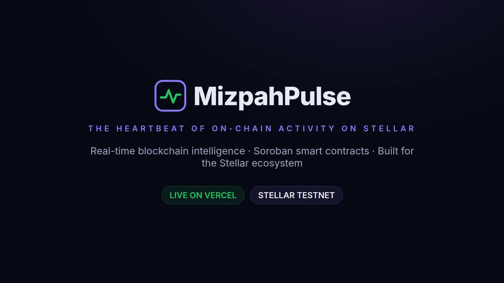

<p align="center">
  
</p>

<h1 align="center">⚡ MizpahPulse</h1>
<p align="center"><em>The heartbeat of on-chain activity on Stellar</em></p>

<p align="center">
  <a href="https://github.com/MizPahPulse/MizPahPulse/actions/workflows/ci.yml"></a>
  <a href="https://mizpah-pulse.vercel.app"></a>
  <a href="./LICENSE"></a>
  <a href="#testing"></a>
  <a href="#testing"></a>
  
  
  <a href="contracts/README.md#gas-benchmark"></a>
  
  <a href="contracts/ERRORS.md"></a>
  
  
  
  
  
</p>

<p align="center">
  <a href="https://mizpah-pulse.vercel.app"><b>🔗 Open Live Demo</b></a> ·
  <a href="#-architecture"><b>Architecture</b></a> ·
  <a href="#-api-reference"><b>API Reference</b></a> ·
  <a href="#-smart-contract"><b>Smart Contract</b></a> ·
  <a href="#-live-demo"><b>▶️ Pitch Video</b></a>
</p>

<p align="center">
  <a href="./screenshots/demo-video.mp4">
    
  </a>
  <br/>  <sub><b>▶️ Watch the 5-minute pitch</b> — problem → solution → live demo → engineering → CTA (with narration)</sub>
</p>

---

## 🎯 The Pitch in 60 Seconds

**The problem.** The Stellar network never sleeps — every second it processes payments, Soroban contract calls, DEX trades, NFT activity, and account changes. But watching that heartbeat in real time means stitching together Horizon streams, RPC calls, and raw ledgers yourself. There's no single, developer-friendly window into what's happening *right now*.

**The solution.** **MizpahPulse** is a real-time blockchain intelligence platform purpose-built for the **Stellar ecosystem**. An ingester worker consumes the network's event streams, normalizes **35+ event types across 6 categories** (payments, smart contracts, DEX, NFTs, tokens, accounts), and pushes them through a WebSocket server to a live dashboard — backed by a REST API, an analytics suite, a Freighter wallet hub, a Soroban contract explorer with direct invocation, and a configurable webhook engine. All of it running on PostgreSQL + Redis in a Turborepo monorepo.

**The proof.**

| Metric | Value |
|---|---|
| 🧪 Tests | **526/526 passing** (399 web · 6 WebSocket · 16 ingester · 1 database · 104 contract) |
| 📈 Coverage (CI-enforced) | **83.86% lines web** (≥65% floor) · **98.69% lines contract** (≥90% floor) |
| 🔗 Smart contract | `PulseContract` — audited, gas-benchmarked, **WASM ≈ 64 KB** |
| 🚨 Error taxonomy | **365 machine-readable error codes** (30 per-class enums) |
| 📡 Realtime | WebSocket (`ws://`) + SSE streams + BullMQ/Redis pipeline |
| 🔌 API | **27+ REST endpoints (v1)** + HMAC-signed webhooks with replay + API keys |
| 🟢 Live | [mizpah-pulse.vercel.app](https://mizpah-pulse.vercel.app) — Stellar Testnet |

**Who it's for:**

- **Developers** — a clean REST API, webhook engine, API-key portal, and SDK examples to build on Stellar activity.
- **Traders & analysts** — live feed, historical analytics, category breakdowns, and top-contract insights.
- **Wallet users** — Freighter integration with one-click transactions and live balances.
- **dApp builders** — the `PulseContract` demonstrates Soroban payment rails, cross-contract calls, and production-grade contract patterns.

---

## 📖 Table of Contents

- [Overview](#-overview)
- [Live Demo](#-live-demo)
- [Architecture](#-architecture)
- [Tech Stack](#-tech-stack)
- [Quick Start](#-quick-start)
- [Smart Contract](#-smart-contract)
- [Wallet Integration](#-wallet-integration)
- [API Reference](#-api-reference)
- [Event Streaming](#-event-streaming)
- [Testing](#-testing)
- [CI/CD](#-cicd)
- [Screenshots](#-screenshots)
- [Documentation](#-documentation)
- [Environment Variables](#-environment-variables)
- [Credits](#-credits)
- [License](#-license)

---

## 🌐 Overview

**MizpahPulse** is a real-time blockchain intelligence platform purpose-built for the **Stellar ecosystem**. It ingests, processes, and visualizes every heartbeat of the network — from simple XLM payments to complex Soroban smart contract invocations.

### ✨ Key Capabilities

| Category | Coverage |
|---|---|
| 💸 **Payments** | XLM transfers, path payments, cross-border remittances |
| 🤖 **Smart Contracts** | Soroban invocations, deployments, events, TTL extensions |
| 📊 **DEX Activity** | Trades, order books, liquidity pool operations |
| 🎨 **NFTs** | Minting, transfers, burns, metadata |
| 🪙 **Tokens** | Trustline changes, asset issuance, clawbacks |
| 👤 **Accounts** | Creation, merging, signer updates, sponsorship |

### 🚀 Deliverables

- **Real-time Dashboard** — Live feed with WebSocket streaming, filters, and search
- **Analytics Suite** — Historical trends, category breakdowns, top contracts
- **Wallet Hub** — Freighter integration, XLM balance, one-click transactions
- **Contract Explorer** — Deployed Soroban contracts with direct invocation UI
- **REST API (v1)** — 27+ endpoints for programmatic access
- **Webhook Engine** — Configurable event delivery to external services
- **Developer Portal** — API key management, SDK examples, integration docs

---

## 🎥 Live Demo

<p align="center">
  <a href="https://mizpah-pulse.vercel.app">
    
  </a>
</p>

**[▶️ Watch the 5-minute pitch video](./screenshots/demo-video.mp4)** — A narrated product pitch: the problem, the solution, a live walkthrough of the production deployment, the engineering story, and why it's different. (MP4 · 5:17 · 1080p — right-click → *Save as* to download.)

<p align="center">
  <video controls width="90%" poster="./screenshots/pitch-video-poster.png">
    <source src="./screenshots/demo-video.mp4" type="video/mp4" />
    Your browser doesn't support embedded video — <a href="./screenshots/demo-video.mp4">download the MP4</a>.
  </video>
</p>

---

## 🏗 Architecture

```
mizpah-pulse/
│
├── apps/
│   ├── web/            # Next.js 15 dashboard + REST API      (port 3000)
│   ├── ws/             # Socket.io real-time event server     (port 3001)
│   └── ingester/       # Stellar event ingestion worker
│
├── packages/
│   ├── database/       # Prisma ORM + PostgreSQL schema
│   ├── stellar/        # Stellar SDK integration layer
│   ├── types/          # Shared TypeScript types + Zod schemas
│   └── ui/             # Reusable React component library
│
├── contracts/
│   └── pulse/          # Soroban smart contract (Rust)
│
├── scripts/            # Deployment and automation scripts
└── screenshots/        # Demo screenshots and video
```

### Data Flow

```
Stellar Network (Horizon SSE + Soroban RPC)
        │
        ▼
   [Ingester] ──► Redis Queue ──► [Worker] ──► PostgreSQL
        │                                          │
        ▼                                          ▼
   [WebSocket Server] ◄──────────────────── [REST API]
        │                                          │
        ▼                                          ▼
   [Next.js Dashboard] ◄──── Real-time UI ──── [External Clients]
```

Architectural decisions are recorded in [`docs/adr/`](docs/adr/) (monorepo layout, Prisma database, WebSocket real-time, rate limiting).

---

## 🛠 Tech Stack

| Layer | Technology |
|---|---|
| **Frontend** | Next.js 15 (App Router), React 19, Tailwind CSS, Recharts, Lucide Icons |
| **Backend** | Next.js API Routes, Socket.io, BullMQ |
| **Database** | PostgreSQL 16 + Prisma ORM |
| **Cache / Queue** | Redis (BullMQ + Pub/Sub) |
| **Blockchain** | Stellar SDK v13, Horizon, Soroban RPC, `@stellar/freighter-api` v3 |
| **Smart Contracts** | Rust + Soroban SDK v21 |
| **Infrastructure** | Turborepo, Docker Compose, GitHub Actions, Vercel |
| **Testing** | Vitest, React Testing Library, Rust cargo test |
| **Language** | TypeScript (strict), Rust |

---

## 🚀 Quick Start

### Prerequisites

- **Node.js** ≥ 20
- **Docker** & Docker Compose (for PostgreSQL + Redis)
- **npm** ≥ 10
- **Rust** ≥ 1.88 (for contract development only)
- [Freighter Browser Extension](https://freighter.app) (for wallet features)

### One-Command Setup

```bash
git clone https://github.com/MizPahPulse/MizPahPulse.git
cd MizPahPulse
npm install
npm run docker:up
cp .env.example .env
npx prisma generate --schema=packages/database/prisma/schema.prisma
npx prisma migrate dev --schema=packages/database/prisma/schema.prisma
npm run dev
```

> **Tip:** `npm run dev:all` starts **web**, **ws**, and **ingester** together
> with labeled, colored output (Ctrl+C stops all three). To start just one,
> use `npm run dev -w apps/web` (or `-w apps/ws` / `-w apps/ingester`).

### Access Points

| Service | URL |
|---|---|
| Dashboard | [http://localhost:3000](http://localhost:3000) |
| WebSocket | `ws://localhost:3001` |
| REST API | [http://localhost:3000/api/v1](http://localhost:3000/api/v1) |

### Full Docker Stack

```bash
docker compose up -d
```

### Docker without Redis (minimal profile, issue #75)

Working on the UI/API only? Skip Redis (and the ws/ingester services that
need it). The web app runs in its degraded fallback mode — in-memory rate
limiting, no real-time WebSocket feed:

```bash
docker compose -f docker-compose.minimal.yml up -d
# or, equivalently:
docker compose -f docker-compose.minimal.yml --profile minimal up -d
```

This starts just **PostgreSQL + web**. Don't run the minimal and full stacks at
the same time — they share ports and container names.

### Mock API mode — no Docker at all (issue #100)

No Postgres or Redis available? The web API can run against deterministic
in-memory sample data with the same response shapes as the real endpoints:

```bash
npm install
MOCK_API=1 npm run dev -w apps/web
```

Open http://localhost:3000 and browse the dashboard, feed, search, and
webhooks pages with seeded demo data. See `.env.example` (and
`packages/database/src/mock.ts`) for details.

---

## 📜 Smart Contract

MizpahPulse ships with a **Soroban smart contract** (`PulseContract`) demonstrating production-grade patterns:

### Features

| Endpoint | Signature | Description |
|---|---|---|
| `pulse` | `(caller: Symbol) → u32` | Increments counter, emits event |
| `broadcast_pulse` | `(target: Address, caller: Symbol) → (u32, Val)` | Cross-contract pulse broadcast |
| `on_pulse_received` | `(count: u32, caller: Symbol) → Symbol` | Receiver for inter-contract calls |
| `get_pulse_count` | `() → u32` | Read current count |
| `get_pulse_data` | `() → PulseData` | Read full state |
| `get_last_received` | `() → Option<(u32, Symbol)>` | Last cross-contract receipt |
| `tip_token` / `tip_xlm` | `(token, from, to, amt, caller)` | Pay any SEP-41 asset / native XLM + pulse |
| `tip_token_from` | `(token, from, to, amt, caller)` | Allowance-based pull payment (`transfer_from`) |
| `batch_tip_token` / `batch_tip_xlm` | `(token, from, [(to, amt)], caller)` | Payroll: N recipients, one pulse |
| `withdraw_token` / `withdraw_xlm` | `(token, to, amt)` | Owner-only drain of contract-held funds |

> **Audited & measured:** see [`contracts/AUDIT.md`](./contracts/AUDIT.md) for the
> formal audit report (invariants, findings, threat model) and
> [`contracts/ERRORS.md`](./contracts/ERRORS.md) for the 365-code error
> taxonomy.

### Deployment

| Detail | Value |
|---|---|
| **Network** | Stellar Testnet |
| **Contract ID** | `CC4HXCVIOPUOS2UJFLTM6WP2ESNSWM4BGJ26XR4SRRVB74TOZMC7EE2C` |
| **Create Tx** | [`ee73ae2e...`](https://stellar.expert/explorer/testnet/tx/ee73ae2e3126d52878ff010346f8d4645383e606217a7bf3a1c16d2df40ecf06) |
| **Verified** | [View on Stellar Expert →](https://stellar.expert/explorer/testnet/tx/ee73ae2e3126d52878ff010346f8d4645383e606217a7bf3a1c16d2df40ecf06) |

> ⚠️ **Deployment status:** the on-chain instance above predates the payment
> rails, error taxonomy, and native-rail configuration added in the latest
> release. Re-deploy to Testnet with `DEPLOYER_SECRET=S... npx tsx
> scripts/deploy-contract.ts` — the script verifies that the on-chain
> `WASM_HASH` matches the local artifact before reporting success — then run
> `initialize --owner <pubkey>` on the fresh contract and point
> `NEXT_PUBLIC_PULSE_CONTRACT_ID` at it.

```bash
# Deploy your own instance
cd contracts && cargo build --target wasm32-unknown-unknown --release
DEPLOYER_SECRET=S... npx tsx scripts/deploy-contract.ts
```

### Interacting from the Frontend

```tsx
import { useContractInvoke } from '@/hooks/useContractInvoke';

// Read-only (simulated, no transaction)
const { readOnly } = useContractInvoke(contractId);
const count = await readOnly('get_pulse_count');  // → number

// State-changing (Freighter sign → submit)
const { invoke } = useContractInvoke(contractId);
const result = await invoke('pulse', ['alice']);
// → { hash: '...', explorerUrl: 'https://...', returnValue: 6 }

// Cross-contract communication
const { invoke } = useContractInvoke(contractId);
await invoke('broadcast_pulse', [targetContractId, 'alice']);
```

---

## 👛 Wallet Integration

Full **Freighter wallet** integration on Stellar Testnet with comprehensive error handling:

| Feature | Implementation |
|---|---|
| **Connect** | `useFreighter` hook via `@stellar/freighter-api` v3 |
| **Disconnect** | Clean state reset with UI feedback |
| **Session Persistence** | Auto-reconnect across page refreshes |
| **Missing Wallet** | Graceful detection + install prompt |
| **Balance** | Live XLM pull from Horizon, 30s auto-refresh |
| **Send XLM** | Build → Freighter sign → submit with balance validation |
| **Feedback** | Success: tx hash + explorer link. Error: categorized message + retry |

### Freighter Setup

1. Install [Freighter](https://freighter.app)
2. Switch to **Testnet** network
3. Visit `/dashboard/wallets` → **Connect Freighter**

---

## 📡 API Reference

### REST API (v1)

| Method | Endpoint | Description |
|---|---|---|
| `GET` | `/api/v1/events` | Paginated event query with filters |
| `GET` | `/api/v1/events/live` | Server-Sent Events stream |
| `GET` | `/api/v1/accounts/:id` | Account details + on-chain data |
| `GET` | `/api/v1/accounts/:id/activity` | Paginated account activity |
| `GET` | `/api/v1/assets?q=` | Search assets by code or issuer |
| `GET` | `/api/v1/contracts/:id` | Contract details + stats |
| `GET` | `/api/v1/contracts/:id/events` | Paginated contract events |
| `GET` | `/api/v1/stats` | Network-wide statistics (incl. top accounts) |
| `GET` | `/api/v1/stats/timeseries` | Event counts bucketed by hour/day over 24h/7d/30d |
| `GET` | `/api/v1/status` | Service dependency status (DB, WS, last event) |
| `GET` | `/api/v1/search` | Multi-entity search |
| `GET` | `/api/v1/audit-logs` | Audit log retrieval (filter by action/resource/user) |
| `GET` | `/api/v1/preferences` | Read notification preferences |
| `PATCH` | `/api/v1/preferences` | Update notification preferences |
| `GET` | `/api/v1/webhooks/:id/deliveries` | Delivery attempt history per webhook |
| `POST` | `/api/v1/webhooks` | Register webhook endpoint |
| `POST` | `/api/v1/webhooks/batch` | Register up to 50 webhooks atomically |
| `PATCH` | `/api/v1/webhooks/:id` | Update webhook config |
| `DELETE` | `/api/v1/webhooks/:id` | Delete webhook endpoint |
| `POST` | `/api/v1/webhooks/:id/rotate-secret` | Rotate signing secret (returned once) |
| `POST` | `/api/v1/webhooks/:id/deliveries/:deliveryId/replay` | Re-queue a failed delivery |
| `GET` | `/api/v1/api-keys` | List API keys (masked) |
| `POST` | `/api/v1/api-keys` | Create an API key (secret shown once) |
| `DELETE` | `/api/v1/api-keys/:id` | Revoke an API key |
| `GET` | `/api/v1/transactions/:hash` | Transaction status (DB + Horizon fallback) |

See [docs/webhooks.md](docs/webhooks.md) for webhook payload examples, the
`X-Webhook-Signature` format, verification snippets, and retry semantics.

### WebSocket Events

Connect to `ws://localhost:3001`

| Direction | Event | Description |
|---|---|---|
| Client → Server | `subscribe:eventTypes` | Filter by event type |
| Client → Server | `subscribe:categories` | Filter by category |
| Client → Server | `subscribe:accounts` | Filter by account |
| Server → Client | `event` | Real-time event payload |
| Bidirectional | `stats` | Connection statistics |

### Event Categories

MizpahPulse tracks **35+ event types** across 6 categories:

| Category | Examples |
|---|---|
| 💸 Payment | XLM transfers, path payments |
| 🤖 Contract | Soroban invoke, deploy, extend TTL |
| 📊 DEX | Trades, order create/cancel |
| 🎨 NFT | Mint, transfer, burn |
| 🪙 Token | Transfer, trustline, clawback |
| 👤 Account | Create, merge, sponsorship |

---

## 🧪 Testing

```bash
# Web suite (hooks, utilities, API logic, components)
cd apps/web && npx vitest run --coverage   # 399 tests, 55 files

# Other workspaces (Node test runner) — ws 6, ingester 16, database 1
(cd apps/ws && npx tsx --test src/*.test.ts)
(cd apps/ingester && npx tsx --test src/*.test.ts)
(cd packages/database && npx tsx --test src/*.test.ts)  # needs Postgres

# Smart contract tests (unit + proptest + gas-regression guards + benchmark)
cd contracts && cargo test                # 104 tests
```

### Test Suite

```
✓ Web suite                  399 passed  (hooks, lib utilities, API logic, components)
✓ WebSocket server            6 passed
✓ Ingester                   16 passed
✓ PulseContract tests       104 passed  (ownership, pausability, multi-sig, rate limits,
                                          per-address limits, cap, time-lock, upgrade, kill,
                                          payments, batch tips, allowance tips, property tests,
                                          365-code taxonomy, gas-regression guards, benchmark)
✓ Database                     1 passed  (runs in CI with Postgres; skips locally without it)
━━━━━━━━━━━━━━━━━━━━━━━━━━━━━━━━━━━━━━━━━━━━━━━━━━━━━━━━━
  Total: 526/526 passing (525 passing without Postgres)
```

**Coverage** is enforced in CI:

| Layer | Measured | CI floor |
|---|---|---|
| Contract (`src/lib.rs`) | 98.69% lines / 93.75% functions (`llvm-cov`) | ≥ 90% lines |
| Web logic (`apps/web/src/lib/**`) | 83.86% lines / 88.97% branches (vitest v8) | ≥ 65% lines / ≥ 80% branches |

Every contract operation additionally carries host-budget gas guards. See
[`contracts/AUDIT.md`](./contracts/AUDIT.md) for the formal audit report and
[`contracts/README.md`](./contracts/README.md) for the gas benchmark.

---

## ⚙️ CI/CD

| Job | Trigger | Description |
|---|---|---|
| **Lint & Typecheck** | Push, PR | Prettier, ESLint, TypeScript |
| **Test** | Push, PR | Vitest frontend + Rust contract tests |
| **Build** | Push, PR | Turborepo full build |
| **Contract** | Push, PR | Cargo test + WASM build + artifact upload |
| **E2E (Playwright)** | Push, PR | Full browser flow against the built app (mock mode) |
| **Lighthouse** | Push, PR | Performance, accessibility, SEO audits |
| **Dependency Audit** | Push, PR, weekly | `npm audit` critical gate + `cargo audit` |
| **CodeQL** | Push, PR, weekly | GitHub code scanning (JS/TS) |
| **Secret Scan** | Push, PR, weekly | TruffleHog — leaked secrets detection |
| **Deploy Contract** | Manual (`workflow_dispatch`) | Deploy WASM to Stellar Testnet |
| **Docker** | Push to `main` | Multi-service Docker build |

The full suite also runs as a **weekly regression** (Mondays) via a scheduled trigger on `ci.yml`.

### 🛡 Branch protection (`main`)

`main` is a **protected branch** — nothing lands on it except through a pull request that passes the full gate. Protection is enforced at the GitHub level (Settings → Branches):

| Rule | Setting |
|---|---|
| **Required status checks** | `Lint & Typecheck`, `Test`, `Build`, `Smart Contract`, `Playwright e2e`, `Lighthouse performance budgets`, `npm audit`, `cargo audit`, `Analyze` (CodeQL), `TruffleHog secret scan` |
| **Branches up to date** | ✅ Strict — a PR must be rebased on the latest `main` before merging |
| **Required reviews** | 1 approving review (admins exempt) |
| **Conversation resolution** | ✅ All PR comments must be resolved before merge |
| **Force pushes** | ❌ Blocked |
| **Deletions** | ❌ Blocked |

Consequences to know when contributing:

- **Direct pushes to `main` are rejected** — open a PR from a feature branch instead; the full pipeline above runs on it automatically.
- Main-only jobs (`Docker Build`, `Contract WASM Reproducibility`, `Deploy Contract`) run **after** the merge, on `main` itself — they are not PR requirements.
- The dependency bot (Dependabot) also goes through this gate: grouped patch/minor PRs are auto-approved and auto-merged when the required checks pass.

---

## 📸 Screenshots

<p align="center">
  
  
</p>

<p align="center">
  
  
</p>

<p align="center">
  
  
</p>

<p align="center">
  <em>📱 Mobile Responsive</em><br/>
  
  
</p>

All screenshots are captured against the live deploy with
[`scripts/capture-screenshots.mjs`](scripts/capture-screenshots.mjs) (Playwright, 1440×900 desktop / 375×812 mobile).

---

## 📚 Documentation

- [`docs/webhooks.md`](docs/webhooks.md) — webhook payloads, `X-Webhook-Signature` format, verification snippets, retry semantics
- [`docs/adr/`](docs/adr/) — Architecture Decision Records (monorepo, Prisma, WebSocket real-time, rate limiting)
- [`contracts/README.md`](contracts/README.md) — PulseContract docs + gas benchmark
- [`contracts/AUDIT.md`](contracts/AUDIT.md) — formal audit report (invariants, findings, threat model)
- [`contracts/ERRORS.md`](contracts/ERRORS.md) — the 365-code error taxonomy
- [`contracts/SECURITY.md`](contracts/SECURITY.md) — contract-specific security notes

---

## 🔧 Environment Variables

Copy `.env.example` → `.env` and configure:

| Variable | Req | Description | Default |
|---|---|---|---|
| `DATABASE_URL` | ✓ | PostgreSQL connection string | `postgresql://...` |
| `REDIS_URL` | ✓ | Redis connection URL | `redis://localhost:6379` |
| `STELLAR_NETWORK` | ✓ | `TESTNET` / `PUBLIC` / `FUTURENET` / `SANDBOX` | `TESTNET` |
| `NEXT_PUBLIC_PULSE_CONTRACT_ID` | ✓ | Deployed contract ID | `CC4HXCVI...` |
| `NEXT_PUBLIC_WS_URL` | ✓ | WebSocket server URL | `http://localhost:3001` |
| `CORS_ORIGIN` | ✓ | CORS origin | `http://localhost:3000` |
| `WEBHOOK_SECRET` | ✓ | Webhook signing secret | — |
| `JWT_SECRET` | ✓ | JWT signing secret | — |
| `API_KEY_SECRET` | ✓ | API key generation secret | — |
| `DEPLOYER_SECRET` | ✱ | Funded Testnet secret (deploy only) | — |
| `NODE_ENV` | — | Environment | `development` |
| `NEXT_PUBLIC_STELLAR_NETWORK` | — | Public network | `TESTNET` |
| `STELLAR_HORIZON_URL` | — | Custom Horizon URL | Auto-derived |
| `STELLAR_SOROBAN_RPC_URL` | — | Custom RPC URL | Auto-derived |
| `WS_PORT` | — | WebSocket port | `3001` |

> ✱ `DEPLOYER_SECRET` is only needed for running `scripts/deploy-contract.ts`.

---

## 🙏 Credits

Built with ❤️ using:

| Tool | Role |
|---|---|
| [Next.js](https://nextjs.org) | React framework |
| [Stellar SDK](https://developers.stellar.org) | Horizon & Soroban RPC |
| [Freighter](https://freighter.app) | Stellar browser wallet |
| [Prisma](https://prisma.io) | TypeScript ORM |
| [Socket.io](https://socket.io) | Real-time WebSockets |
| [BullMQ](https://bullmq.io) | Job queue |
| [Tailwind CSS](https://tailwindcss.com) | Utility CSS |
| [Lucide](https://lucide.dev) | Icons |
| [Turborepo](https://turbo.build) | Monorepo build |
| [Docker](https://docker.com) | Containerization |
| [GitHub Actions](https://github.com/features/actions) | CI/CD |
| [Playwright](https://playwright.dev) | Browser automation |
| [Vercel](https://vercel.com) | Hosting |

---

## 📄 License

MIT © [MizpahPulse](https://github.com/MizpahPulse)

---

<p align="center">
  <sub>Built for hackathons. Ready for production.</sub>
</p>